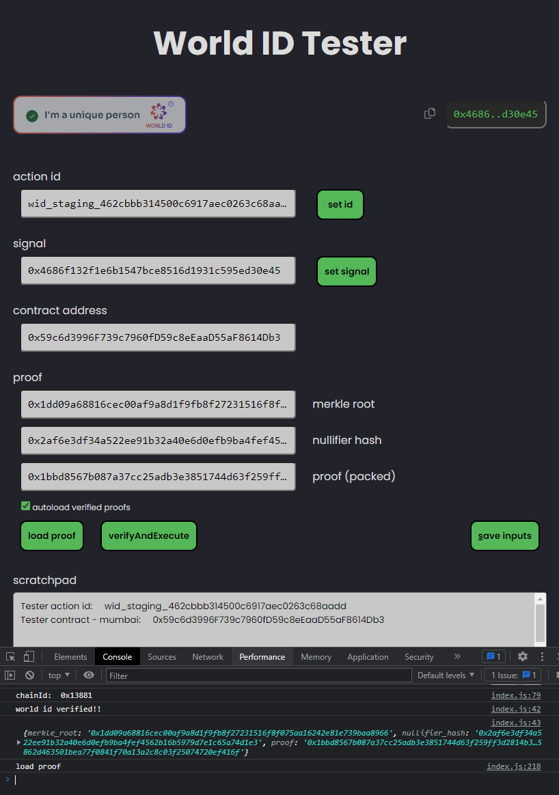

# World ID Tester

https://world-id-tester.vercel.app/

A vanilla JS frontend giving you an easy way try out the World ID widget and test your World ID configuration and smart contract. 

Use it as a quick way to introduce yourself to getting started with World ID, and as a tool to sanity check when you're diagnosing issues with your World ID config and smart contract.

## Set up a test identity
* go the World ID simulator: https://simulator.worldcoin.org/
* click Create temporary identity at the bottom
* click VERIFY YOUR IDENTITY and click VERIFY NOW and DONE
* it can take about 5 minutes for an ID to be ready to use, and it seems best to refresh just before a verification

## Test your World ID action ID with the widget
*  Use the World ID Tester Action ID - wid_staging_462cbbb314500c6917aec0263c68aadd or set up your own at the Worldcoin developer portal https://developer.worldcoin.org/actions
*  Set the front end up with the Action ID (requires save and page reload) and set a signal, which is commonly a user's wallet address.
* click the World ID widget at the top left and click Copy QR code
* Go to back to the simulator and refresh the page for good measure
* Click Enter or paste QR at the top and paste the code you copies into the input box at the bottom
* After a few seconds the simulator should respond with World ID Tester wants to verify ... click VERIFY WITH WORLD ID. If the simulator doesn't show this message, try refreshing the World ID Tester page to re-init the widget, and restart the process from clicking on the Widget.
* once you have the Verification Successful message on the simulator, return to the World ID Tester and the widget dialog should show Identity Confirmed!. Click continue
* if you had the autoload verified proofs checkbox check, the proof received by World ID Tester will be autoloaded into the merkle root, nullifier hash and proof (packed) inputs. Otherwise, click load proof. You can also see the proof as received in the browser's console (F12)

## Test On-Chain Verification
* Test on-chain verification with the World ID Tester smart contract at address 0x59c6d3996F739c7960fD59c8eEaaD55aF8614Db3 on Polygon Mumbai, or the verifyAndExecute function of your own smart contract
* set the World ID Tester Action ID to the same as used in the smart contract and follow the steps above
* set the contract address to the target smart contract and click the verifyAndExecute button
* confirm the transaction, and if all is well, the transaction will succeed. If not, txn return data can be veiwed in the browser console.
* note: you can generate a proof several times with the same simulator identity, but you will only be able to verify the proof successfully once (which is kinda the point). If you want to retest verifyAndExecute after a successful on-chain verification, you'll have to create a fresh identity on simulator and follow the proceeding steps to generate a new proof with a unique nullifier hash.

## Worldcoin Resources
* about Worldcoin
..* https://id.worldcoin.org/
..* https://worldcoin.org/

* dev links
https://id.worldcoin.org/quick-start
https://developer.worldcoin.org/

